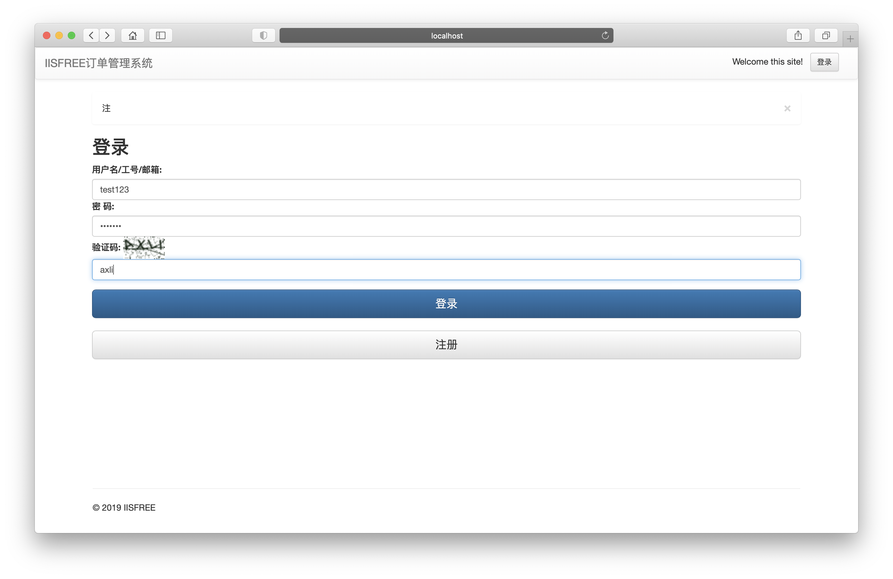
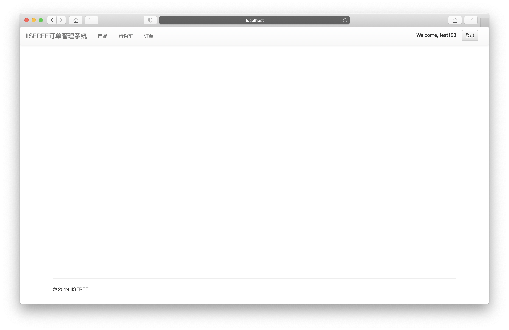
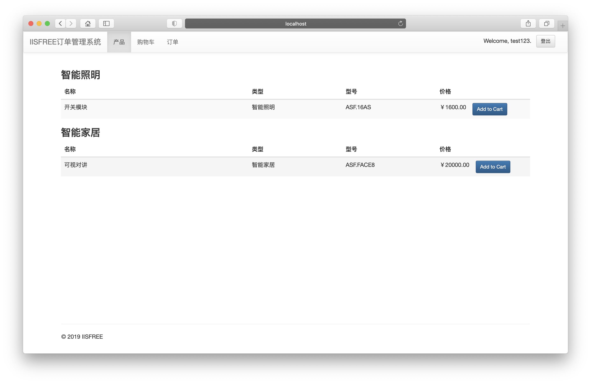
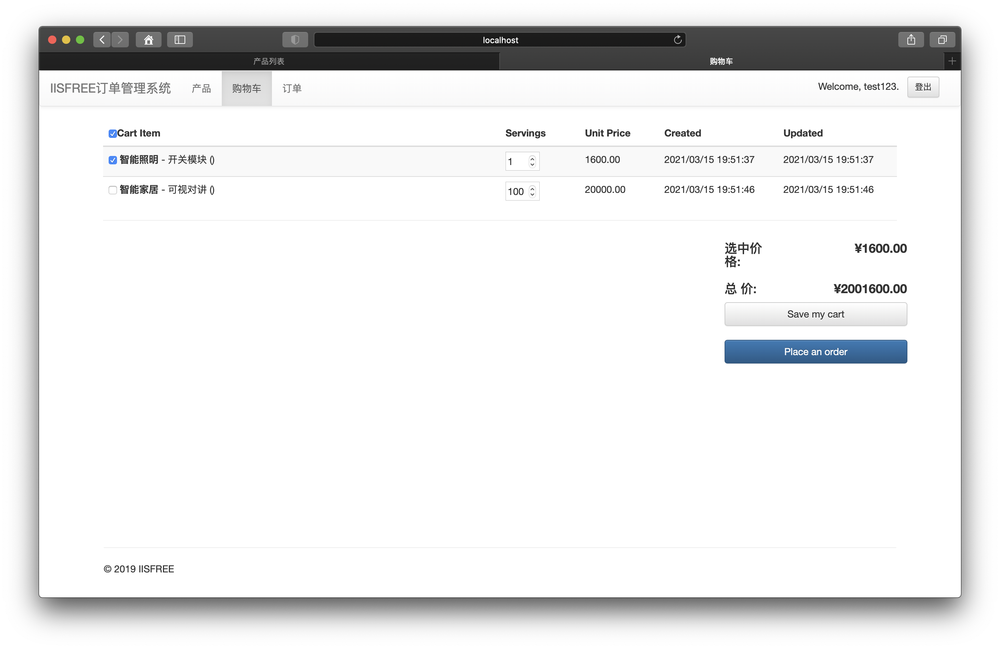
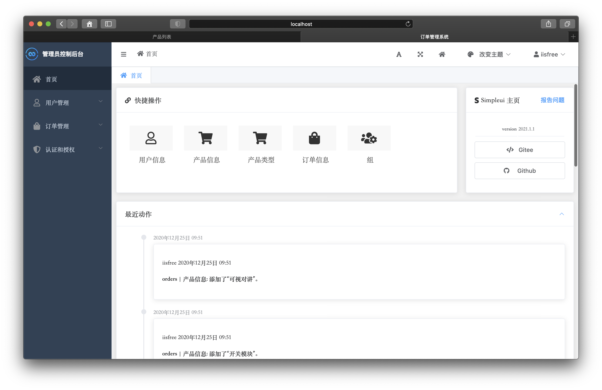
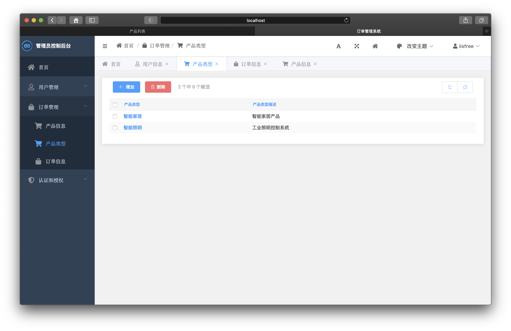
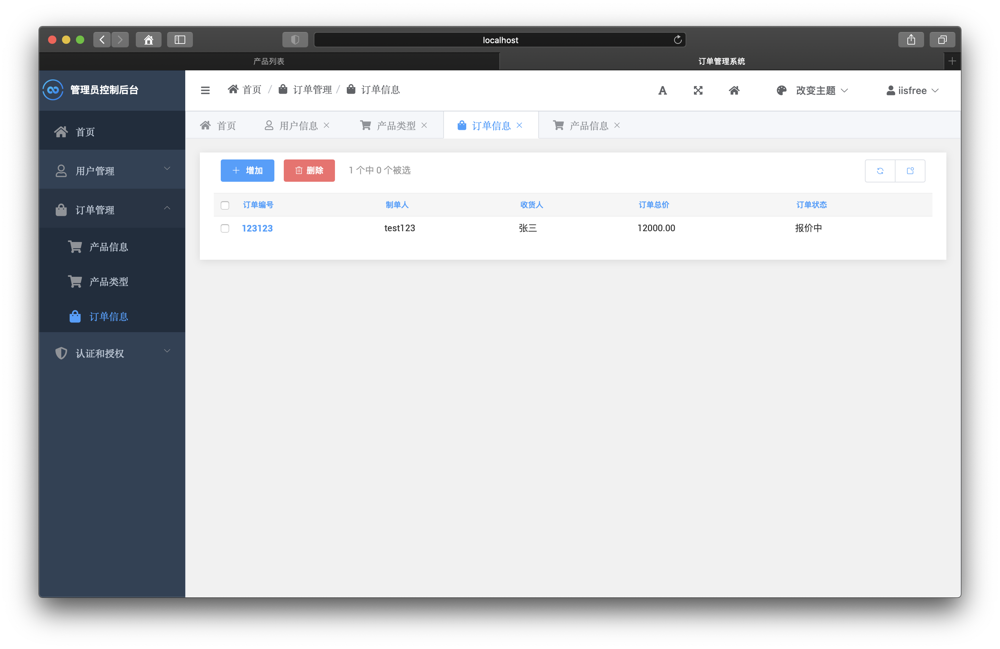
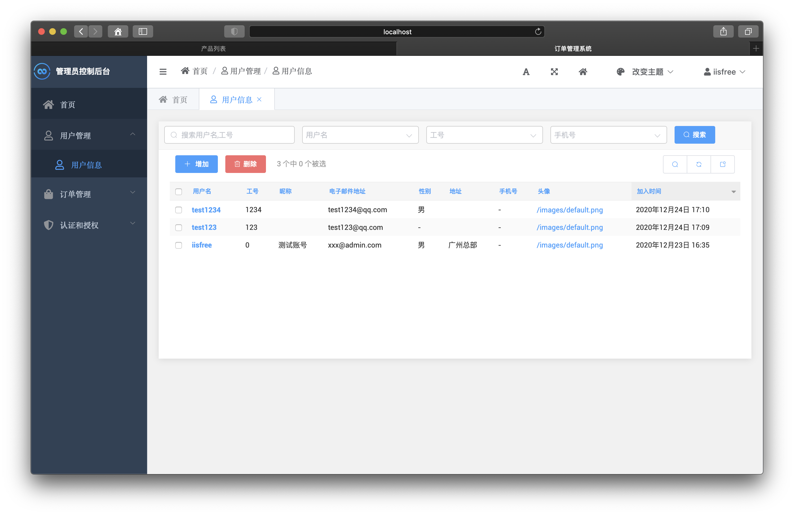

## Mushroom 订单管理系统
---

### 需求

* 设计一个管理系统，可以管理产品信息，生成订单，并追踪订单的状态。

### 开发环境

* 开发语言：Python 3.8
* web框架：Django 3.1
* IDE：Pycharm community edition

### 功能的设计

-[x] 产品管理

-[] 购物车管理

-[] 订单管理

-[x] 用户管理

-[x] 后台管理界面

-[x] 注册，登陆，登出功能

### 功能展示

#### 注册

#### 登陆

#### 产品展示

#### 后台管理

